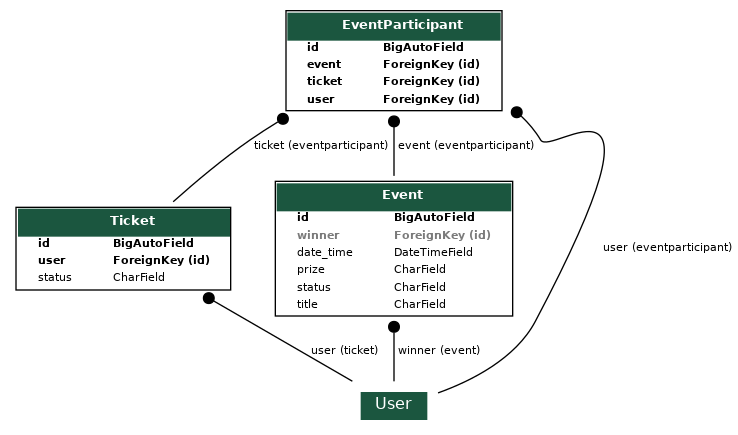

# Lucky_Draw_Gaming_Service

### Purpose
An API service which allows users to get Lucky Draw Raffle tickets and use one lucky draw raffle ticket to participate in a lucky draw game. This is a Grofers Internship Exercise.

### Installation:
Requirements:
- Python 3.8 runtime
- Django >= 3.2
- Other dependencies in `Pipfile`

Procedure:
- Install [python](https://www.python.org/downloads/) in your environment(pre-installed on Ubuntu).
- Navigate to the cloned repository.
    ```
    cd <project_directory_name>     # Lucky_Draw_Gaming_Service
    ```
- Install `pipenv` for dependency management
    ```
    pip install pipenv
    ```
- Use pipenv to install other dependencies from `Pipfile`
    ```
    pipenv install --dev
    ```
- Activate the new virtual environment
    ```
    pipenv shell
    ```
- Change to source code directory
    ```
    cd lucky_draw
    ```
- Make database migrations
    ```
    python manage.py makemigrations
    python manage.py migrate
    ```
- Create a superuser
    ```
    python manage.py createsuperuser
    ```
- Run development server on localhost
    ```
    python manage.py runserver 
    ```
- Head over to <localhost:8000/admin> for admin dashboard

- You may use any platform like [Postman](https://www.postman.com/), [Insomnia](https://insomnia.rest/) or [Swagger](https://swagger.io/) for testing APIs

### ER Diagram:


### Screenshots

Below are screenshots in Postman platform

- Signup <br/><br/>
  
  

- Login <br/><br/>
  
  

- Get Tickets <br/><br/>
  
  

- Upcoming Events <br/><br/>
  


- Participate <br/><br/>
  
  

- Past Winners <br/><br/>
  
  

- Compute Winner for an Event<br/><br/>
  
  

- Logout <br/><br/>
  
  